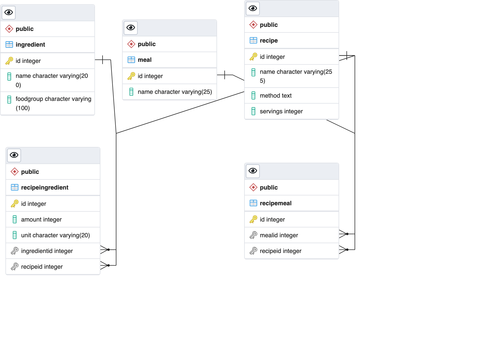

# Recipe API

## Description

An API for recipes and their related data.

## Production

https://glacial-taiga-62544.herokuapp.com/

## Database model

## GET Endpoints

### /recipes

Lists all recipes in the database.

### /ingredients

Lists all ingredients in the database.

### /meals

Lists all meals in the database.

### /ingredients/:id

Lists a specific ingredient's data.

### /recipes/:id

Lists a specific recipe's all relevant data.

## POST Endpoints

### /recipes

Creates a new recipe.

### /ingredients

Creates a new ingredient.

### /meals

Creates a new meal.

